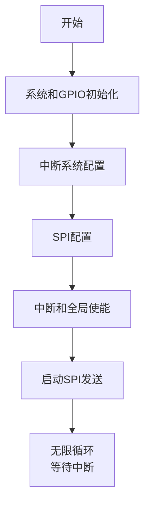

就直接是md文件但是需要加上标号前缀如下

```mermaid

flowchart TD

    A[开始] --> B[系统和GPIO初始化]

    B --> C[中断系统配置]

    C --> D[SPI配置]

    D --> E[中断和全局使能]

    E --> F[启动SPI发送]

    F --> G[无限循环<br>等待中断]

```
[教程](https://blog.csdn.net/qq_37687649/article/details/101016574)
# [网页版](https://www.mermaidchart.com/app/dashboard)
